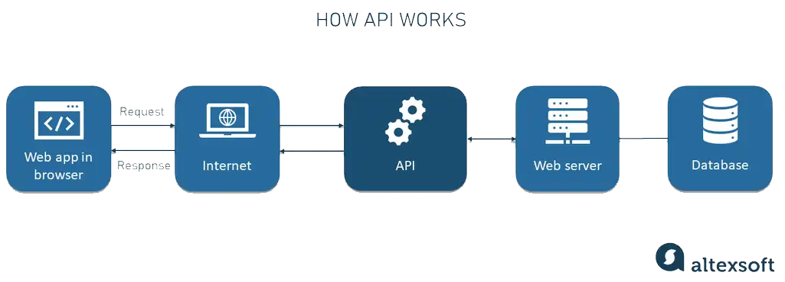

# Day 28 Exercise API

# Table Of Content
- [Day 28 Exercise API](#day-28-exercise-api)
- [Table Of Content](#table-of-content)
- [What is an API](#what-is-an-api)
  - [How do API's Work?](#how-do-apis-work)
    - [Remote Procedure Call (RPC)](#remote-procedure-call-rpc)
    - [Service Object Access Protocol (SOAP)](#service-object-access-protocol-soap)
    - [Representational State Transfer (REST)](#representational-state-transfer-rest)
- [What is HTTP](#what-is-http)
  - [What is an HTTP Method](#what-is-an-http-method)
      - [GET](#get)
      - [POST](#post)
      - [HEAD](#head)
    - [PUT](#put)
- [Bibliography](#bibliography)

 

# What is an API

An API, or <i>application programming interface</i>, is a set of rules or protocol that let software applications communicate with each other to exchange data, features and functionality.

API's simplify application development by allowing developers to integrate data, services and capabilities from other applications, instead of developing them from scratch

 

## How do API's Work?

The working principle of an API is commonly expressed through the request-response communication between a client and a server. The client is any front-end application that a user interacts with.

 

### Remote Procedure Call (RPC)

Web API's may adhere to resource exchange principles based on a Remote Procedure Call or RPC. This protocol specifies the interaction between applications based on the client server architecture.

 

### Service Object Access Protocol (SOAP)

 SOAP is a lightweight protocol for exchanging structured information in a decentralized, distributed environment, according to the definition by Microsoft that developed it.

 

### Representational State Transfer (REST)

The term <i>REST</i> was introduced by computer scientist <i>Roy Fielding</i> in a <a href="https://ics.uci.edu/~fielding/pubs/dissertation/rest_arch_style.htm">dissertion</a> in 2000. Unlike SOAP, which is a protocol REST is a software architectural style with <a href="https://www.geeksforgeeks.org/rest-api-architectural-constraints/">six constraints</a> for building applications that work over HTTP, often web services.

 

# What is HTTP

The Hypertext Transfer Protocol (HTTP) is the foundation of the World Wide Web, and is used to load webpages using hypertext links.HTTP is an application layer protocol designed to transfer information between networked devices and runs on top of other layers of the network protocol stack. A typical flow over HTTP involves. a client machine making a request to a server, which then sends a response message.

## What is an HTTP Method

An HTTP method, sometimes referred to as an HTTP verb, indicates the action that the HTTP request excepts from the queried server.  

1. GET

2. PUT
3. POST
4. DELETE
5. PATCH
6. HEAD
7. OPTIONS
8. TRACE
9. CONNECT
    
 

#### GET

The most commonly used HTTP method is GET. The purpose of the GET method is to simply retreive data from the server.

#### POST

The POST HTTP request method sends data to the server for processing. The data sent to the server is typically in the following form:  

- Input fields from online forms.
  
- XML or JSON data.
  
- Text data from query parameters.

#### HEAD

The HTTP HEAD method simply returns metadata about a resource on the server.

### PUT

# Bibliography
- [Altexsoft](https://www.altexsoft.com/blog/what-is-api-definition-types-specifications-documentation/)
  
- [GeeksforGeeks](https://www.geeksforgeeks.org/rest-api-architectural-constraints/)
- [IBM](https://www.ibm.com/topics/api)
- [Dissertation](https://ics.uci.edu/~fielding/pubs/dissertation/top.htm)
- [Cloudfare](https://www.cloudflare.com/learning/ddos/glossary/hypertext-transfer-protocol-http/)
- [TheServerSide](https://www.theserverside.com/blog/Coffee-Talk-Java-News-Stories-and-Opinions/HTTP-methods)